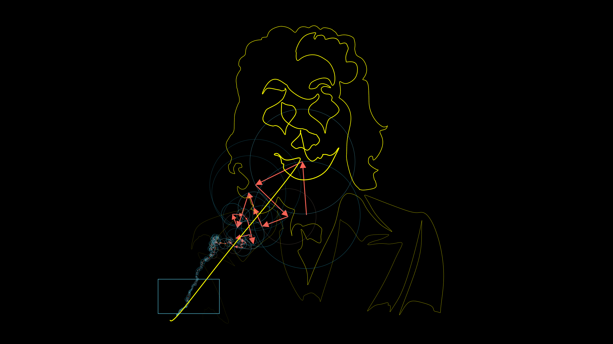

# Fourier transform and its applications

The Fourier transform is one of the most important algorithm in signal processing and communications technology and neural time series data analysis. This repository contains my practice code for the course on this subject by Dr. Cohen. 

1. Foundations of the Fourier transform - terminology
1. Discrete Fourier transform - complete implementation
1. Discrete inverse Fourier transform
